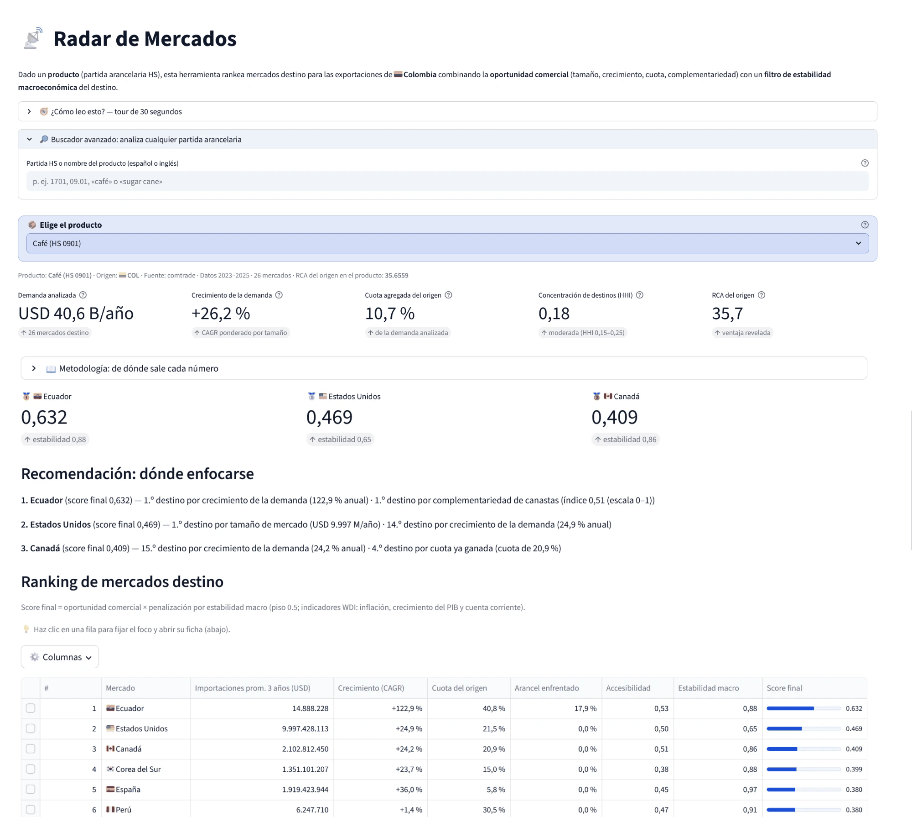
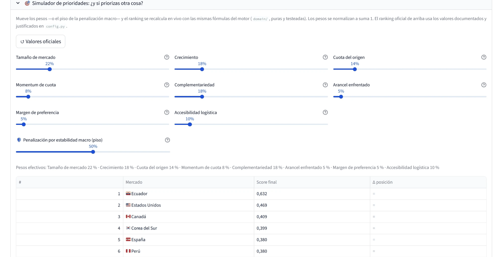
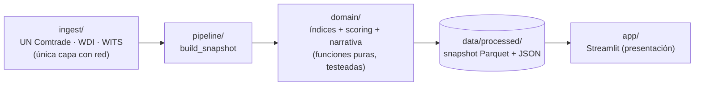

# 📡 Radar de Mercados (`tradefit`)

[](https://github.com/juanjjaramilloz-esp/Radar-de-Mercados/actions/workflows/ci.yml)
[](pyproject.toml)
[](https://radar-de-mercados.streamlit.app/)

**Demo en vivo: <https://radar-de-mercados.streamlit.app/>** · *English summary [below](#english-summary).*

Screener de mercados de exportación: dado un **producto** (partida
arancelaria HS) con origen **Colombia**, rankea 26 mercados destino
(18 OCDE/Asia + 8 LATAM) combinando **oportunidad comercial** (demanda,
crecimiento, cuota, complementariedad, arancel enfrentado) con un **filtro
de estabilidad macroeconómica** del destino. Todo con **datos reales** (UN Comtrade Plus,
World Bank WDI y WITS) y un motor económico **defendible**: cada métrica
cita su definición académica y tiene un test con un valor calculado a mano.



## Qué hace

- **Ranking de 26 mercados destino** (incl. México, Brasil, Chile, Perú,
  Ecuador, Costa Rica, Panamá y Rep. Dominicana) con score transparente:
  promedio ponderado de 6 métricas normalizadas × penalización por
  inestabilidad macro.
- **Contexto Colombia-céntrico por destino**: acuerdo comercial vigente
  (MinCIT), cuota del destino en las exportaciones colombianas del producto,
  concentración de destinos (HHI de Hirschman) y desempeño logístico del
  destino (LPI del Banco Mundial).
- **15 productos curados**: el top de exportaciones de Colombia por partida
  HS4 (UN Comtrade 2024) excluyendo minero-energéticos — café, flores,
  banano, aguacates, azúcar, aceite de palma, medicamentos… — derivado del
  dato con `ingest/top_exports.py`, no a mano.
- **Cualquier partida HS**: un buscador construye el análisis **on-demand**
  de cualquier capítulo/partida/subpartida (descarga, cálculo y caché al momento).
- **Narrativa por reglas** en español e inglés donde **cada frase cita el
  número que la respalda**, con top-3 recomendado y su porqué.
- **Focus por destino**: clic en el mapa (o selector) → ficha del mercado
  con sus drivers del score, arancel + acuerdo, contexto macro-logístico,
  **top-5 competidores con la posición de Colombia** y evolución de la
  demanda.
- **App bilingüe (ES/EN)** con formato numérico por idioma, mapa coropletas,
  evolución temporal, comparador de productos y export a CSV/Excel/PDF.
- **Reproducible**: datos crudos cacheados, snapshot idempotente, cero
  secretos en el repo.
- **Laboratorio de pesos (what-if)**: sliders para re-ponderar las métricas y
  ver en vivo cómo cambia el ranking frente al oficial.



## Metodología (resumen)

| Métrica | Definición | Peso |
|---|---|---|
| Tamaño de mercado | Importaciones promedio del destino, últimos 3 años (cf. ITC *Export Potential Indicator*) | 0.25 |
| Crecimiento | CAGR de esas importaciones en la ventana | 0.20 |
| Complementariedad | Índice de Michaely (1996) sobre capítulos HS2 | 0.20 |
| Cuota del origen | Participación del origen en las importaciones del destino (cf. WITS *partner share*) | 0.15 |
| Momentum de cuota | Δ de esa cuota en la ventana | 0.10 |
| Arancel enfrentado | Efectivamente aplicado: mín(MFN, preferencial) por HS6 (cf. WITS *AHS*; invertido) | 0.10 |

El **RCA de Balassa (1965)** se reporta como contexto (es constante entre
destinos, no pondera), igual que el **acuerdo comercial** vigente (su efecto
ya lo captura el arancel AHS), la **concentración de destinos** (HHI,
Hirschman 1964) y el **LPI logístico** del destino (World Bank *Connecting
to Compete*). El score de oportunidad se multiplica por una
penalización de estabilidad macro (inflación, crecimiento del PIB y cuenta
corriente, WDI) con rampas lineales documentadas. Pesos y umbrales viven en
[`config.py`](src/tradefit/config.py), justificados; la pestaña
**Metodología** de la app muestra fórmula y cita de cada número.

## ¿En qué se diferencia del ITC Export Potential Map?

El [Export Potential Map](https://exportpotential.intracen.org/) del ITC es la
referencia del campo: estima un **potencial de exportación en USD** para 222
países × ~4.000 productos con un modelo econométrico (oferta × demanda ×
facilidad de comercio). El Radar no compite en cobertura — se diferencia en
enfoque:

| | ITC Export Potential Map | Radar de Mercados |
|---|---|---|
| **Salida** | Predicción en USD de potencial (in)explotado | Ranking transparente por score compuesto |
| **Modelo** | Econométrico, cerrado para el usuario | **Glass-box**: cada métrica citada, testeada y visible |
| **Pesos** | Fijos del modelo | **Ajustables en vivo** (laboratorio what-if) |
| **Riesgo del destino** | No penaliza | **Filtro de estabilidad macro** explícito (WDI) |
| **Origen** | 222 países, genérico | **1 origen a fondo**: TLC de Colombia, competidores por destino, concentración de destinos, cuota en las export. COL |
| **Código y datos** | Cerrado | Open source, reproducible, CI con tests |

En corto: el EPM responde *cuánto podrías exportar* con una caja negra
calibrada globalmente; el Radar responde *dónde enfocarse y por qué*, con
cada número defendible y auditable.

## Arquitectura

Tres capas con dependencias en una sola dirección; la lógica económica es
pura, determinística y testeada, aislada de dónde vienen los datos y de cómo
se ven:



- Cada índice económico tiene docstring con su cita y **test con valor
  calculado a mano** (`tests/test_indices.py`).
- Los DataFrames que cruzan capas se validan con esquemas
  [pandera](src/tradefit/contracts.py): falla temprano si una fuente cambió.
- Convenciones completas: [CLAUDE.md](CLAUDE.md) · plan por fases: [PLAN.md](PLAN.md).

## Instalar (Windows)

```powershell
py -m venv .venv
.venv\Scripts\python -m pip install -e ".[dev]"
.venv\Scripts\Activate.ps1
```

## Usar

```powershell
# 1) Construir el snapshot (con caché en data/raw/; --source stub para probar sin red)
python -m tradefit.pipeline.build_snapshot

# 2) Levantar la app (lee data/processed/; el buscador construye partidas nuevas on-demand)
streamlit run src/tradefit/app/main.py
```

El repo incluye un snapshot pequeño de ejemplo para que la demo funcione sin
descargar nada. Para regenerar con datos frescos se necesita una key gratuita
de UN Comtrade en `.env` (ver [`.env.example`](.env.example)); WDI y WITS no
requieren key.

## Calidad

```powershell
pytest                      # tests (sin red; fixtures locales)
ruff check . ; mypy src     # lint + tipos
pre-commit install          # hooks: ruff + mypy + pytest antes de cada commit
```

La misma puerta corre en [CI](.github/workflows/ci.yml) en cada push.

### Actualización de datos

El workflow `Data refresh` revisa las fuentes una vez al mes, conserva los
cachés crudos entre ejecuciones y solo descarga una fuente cuando vence su
política de frescura: Comtrade 60 días, WDI 90 y WITS 180. Si cambian los
snapshots, abre o actualiza la PR `automation/data-refresh`; nunca escribe
directamente sobre `main`. Requiere el secreto de repositorio
`COMTRADE_API_KEY` y habilitar en GitHub **Settings → Actions → General →
Allow GitHub Actions to create and approve pull requests**.

```powershell
# Ver qué fuentes vencerían, sin red ni escrituras
python -m tradefit.pipeline.refresh --dry-run

# Refresco manual completo
python -m tradefit.pipeline.refresh --force
```

---

## English summary

**Live demo: <https://radar-de-mercados.streamlit.app/>** (language toggle in
the sidebar).

Export-market screener: given a product (HS tariff line) originating in
**Colombia**, it ranks 26 destination markets (18 OECD/Asia + 8 Latin
American) by combining **commercial opportunity** — demand size and growth, origin's market share and momentum,
trade complementarity (Michaely 1996) and the tariff effectively faced
(WITS AHS) — with a **macro-stability filter** (World Bank WDI). Built on
real data (UN Comtrade Plus, WDI, WITS) with a defensible engine: every
metric cites its academic definition and is unit-tested against a
hand-calculated value.

Highlights: a curated catalog of **Colombia's top-15 non-mining exports**
(derived from Comtrade data, not hand-picked), Colombia-centric context per
destination (trade agreement in force, destination's share of Colombia's
exports, destination-concentration HHI, World Bank Logistics Performance
Index), a **click-to-focus destination profile** (score drivers, macro &
logistics context, top-5 competing suppliers with Colombia's position,
demand evolution), analysis of **any HS code**
built on demand with caching, a
rule-based bilingual narrative where **every sentence cites its number**,
choropleth map, time evolution, product comparator, CSV/Excel/PDF export,
and a layered architecture (network → pure domain → snapshot → UI) with
one-way dependencies, pandera data contracts, and CI running ruff + mypy +
pytest.
